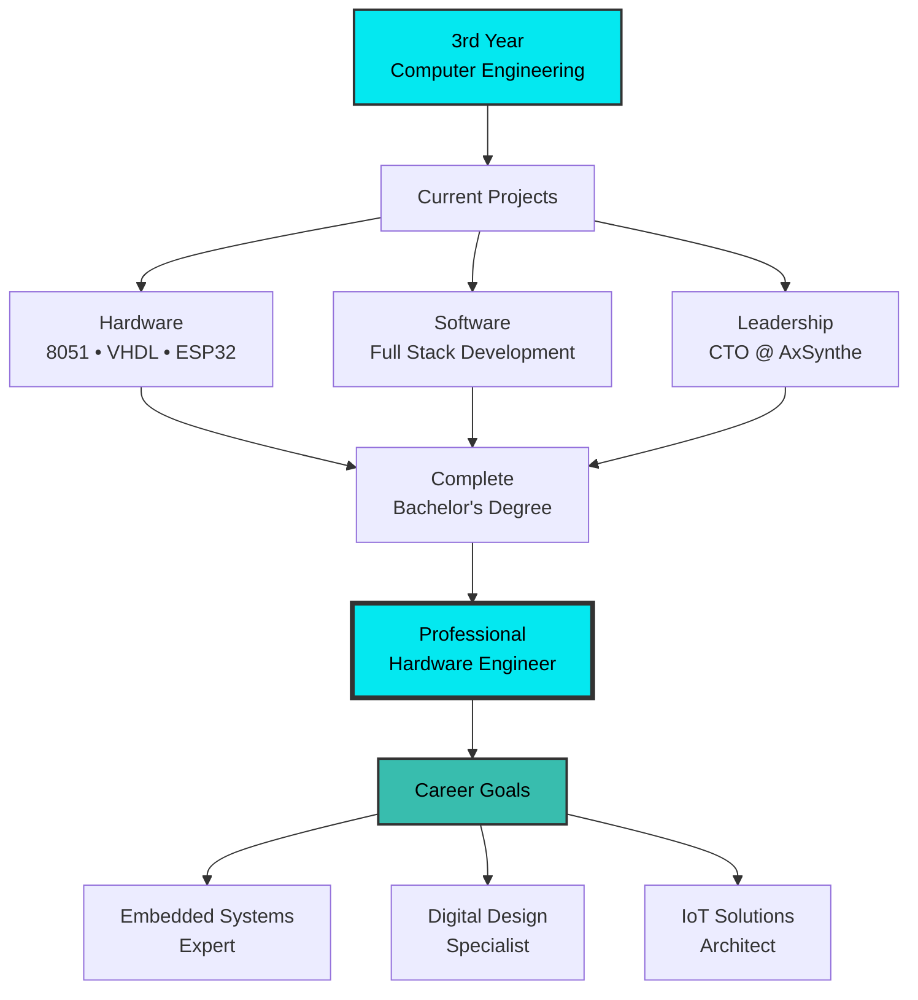

<div align="center">
  
</div>

<h1 align="center"> Hey there!  I'm <a href="https://ishankahirushan.github.io/" target="_blank">Ishanka Hirushan</a>
  
</h1>

<p align="center">
  
</p>

<p align="center">
  <!-- Gmail -->
  <a href="mailto:ishankahirushan22@gmail.com">
    
  </a>

  <!-- LinkedIn -->
  <a href="https://www.linkedin.com/in/ishankahirushan">
    
  </a>

  <!-- Portfolio -->
  <a href="https://ishankahirushan.github.io">
    
  </a>

  <!-- GitHub -->
  <a href="https://github.com/ishankahirushan">
    
  </a>
</p>

---

<table align="center">
  <tr>
    <!-- Left Column -->
    <td width="50%" valign="top">
      
I am **Ishanka Hirushan**, CTO at <a href="https://axsynthegroup.me/" target="_blank">**AXSYNTHEGROUP**</a>. I’m a 3rd-year BSc (Hons) Computer Engineering student with a passion for embedded systems, digital design, and full-stack development 🦄✨.

## 🛠 Hardware Expertise

**Languages**  
 
 


**Microcontrollers (MCUs)**  


**Tools & IDEs**  


 

## 💻 Software Expertise

**Languages**  


  

**Backend Frameworks**  


 

**Frontend Frameworks**  

  

**Databases**  


  
- 💼 Leading **AxSynthe Group** – Tech & Creative Solutions  
    </td>

    <!-- Right Column -->
    <td width="50%" valign="top">
      
    </td>
  </tr>
</table>


---

## 🔧 Hardware & Embedded Systems Arsenal

<div align="center">

### 🎛️ From Assembly to High-Level Architecture

<table>
  <tr>
    <td align="center" width="25%">
      
      <br><b>8051 MCU</b>
      <br><sub>Assembly Language</sub>
      <br><sub>Low-Level Programming</sub>
    </td>
    <td align="center" width="25%">
      
      <br><b>VHDL</b>
      <br><sub>Digital Logic Design</sub>
      <br><sub>Pure Hardware</sub>
    </td>
    <td align="center" width="25%">
      
      <br><b>ESP32</b>
      <br><sub>IoT Development</sub>
      <br><sub>Arduino Framework</sub>
    </td>
    <td align="center" width="25%">
      
      <br><b>IoT Architecture</b>
      <br><sub>Edge-Fog-Cloud</sub>
      <br><sub>Distributed Systems</sub>
    </td>
  </tr>
</table>

</div>

---

## 🚀 Major Hardware Projects

### 🚗 **EEX4436: Automatic Vehicle Parking System**
<div align="center">


</div>

```yaml
Technology Stack:
  Microcontroller: 8051 Family
  Programming: Assembly Language
  Architecture: Low-level embedded system
  
Project Description:
  Intelligent parking management system with automated slot detection
  and barrier control, programmed entirely in 8051 Assembly. 

Key Features:
  ✓ Real-time parking slot availability monitoring
  ✓ Automated barrier control mechanism
  ✓ IR/Ultrasonic vehicle detection sensors
  ✓ LCD display for slot information
  ✓ LED indicators for slot status
  ✓ Buzzer alerts for system events

Technical Highlights:
  • Direct hardware register manipulation
  • Interrupt-driven sensor handling
  • Timer-based control sequences
  • Memory-efficient assembly code
  • Real-time response system

Learning Outcomes:
  ★ Deep understanding of microcontroller architecture
  ★ Assembly language programming mastery
  ★ Low-level hardware interfacing
  ★ Interrupt and timer management
  ★ Embedded system design principles
```

---

### 🚿 **EEX5351: Automatic Tunnel Vehicle Washing System**
<div align="center">


</div>

```yaml
Technology Stack:
  HDL: VHDL (VHSIC Hardware Description Language)
  Platform:  FPGA
  Design: Pure digital logic (NO MICROCONTROLLER!)
  
Project Description:
  Complete automated vehicle washing system designed entirely in VHDL,
  using Finite State Machines and combinational logic.

System Architecture:
  ┌─────────────────────────────────────────────┐
  │     VHDL Digital Logic Controllers          │
  ├─────────────────────────────────────────────┤
  │  • Entry Detection FSM                      │
  │  • Washing Sequence Controller              │
  │  • Safety Interlock Logic                   │
  │  • Timer & Counter Modules                  │
  │  • Output Driver Circuits                   │
  └─────────────────────────────────────────────┘

Key Features: 
  ✓ Multi-stage washing sequence (Pre-wash → Soap → Rinse → Dry)
  ✓ FSM-based state control
  ✓ Vehicle presence detection (IR sensors)
  ✓ Safety interlocks and emergency stop
  ✓ Automated conveyor control
  ✓ Water pump and spray control
  ✓ LED status indicators
  ✓ Buzzer notifications

Technical Implementation:
  • Finite State Machine (FSM) design
  • Synchronous sequential circuits
  • Combinational logic blocks
  • Debouncing circuits
  • Clock dividers and timers
  • Sensor interface modules
  • Actuator control signals

Washing Sequence FSM:
  IDLE → ENTRY_DETECT → PRE_WASH → SOAP_APPLICATION → 
  RINSE → AIR_DRY → EXIT_DETECT → IDLE

Learning Outcomes:
  ★ Advanced VHDL programming
  ★ Digital system design methodology
  ★ FSM design and optimization
  ★ FPGA implementation
  ★ Hardware simulation and testing
  ★ Pure logic-based control (no software!)
```

---

### 🏪 **EEX5346: Smart Snack Management System (SSMS)**
<div align="center">


</div>

```yaml
Technology Stack:
  Edge Layer: ESP32 + Arduino Framework + C++
  Fog Layer: Flask (Python) - Local Gateway
  Cloud Layer: Django + PostgreSQL/SQLite + AI/ML
  Protocols: WebSocket (Edge-Fog), MQTT (Fog-Cloud)
  
Project Description:
  IoT-enabled smart vending machine with distributed Edge-Fog-Cloud
  architecture, providing AI-powered personalized recommendations. 

🌐 Three-Layer Architecture: 

  ┌─────────────────────────────────────────────────┐
  │           CLOUD LAYER (Django)                  │
  │  • AI/ML Recommendation Engine                  │
  │  • User Management & Analytics                  │
  │  • Long-term Data Storage                       │
  │  • Operator Dashboard                           │
  └──────────────────┬──────────────────────────────┘
                     │ MQTT Protocol
                     │ (Reliable, QoS)
  ┌──────────────────▼──────────────────────────────┐
  │           FOG LAYER (Flask)                     │
  │  • Local Gateway & Data Aggregation             │
  │  • Protocol Translation (WebSocket ↔ MQTT)      │
  │  • Message Queuing & Buffering                  │
  │  • Multi-machine Management                     │
  └──────────────────┬──────────────────────────────┘
                     │ WebSocket
                     │ (Real-time, Bidirectional)
  ┌──────────────────▼──────────────────────────────┐
  │         EDGE LAYER (ESP32)                      │
  │  • NFC Reader (User Authentication)             │
  │  • Environment Sensors (Temp, Humidity)         │
  │  • Touchscreen Display (User Interface)         │
  │  • Product Dispensing Mechanism                 │
  │  • Local Processing & Caching                   │
  └─────────────────────────────────────────────────┘

Key Features:
  ✓ NFC-based user authentication (RFID)
  ✓ Guest mode for non-registered users
  ✓ AI-powered personalized snack recommendations
  ✓ Real-time inventory tracking
  ✓ Environment monitoring (temperature, humidity)
  ✓ Health metrics integration
  ✓ Touchscreen interface with visual feedback
  ✓ Secure multi-layer communication
  ✓ Offline capability with data sync
  ✓ Operator analytics dashboard

ESP32 Implementation:
  • WiFi connectivity management
  • NFC/RFID tag reading (PN532/MFRC522)
  • DHT22 temperature & humidity sensor
  • Nextion/TFT touchscreen control
  • Servo motor for dispensing
  • LED indicators (RGB)
  • HTTP client for REST API calls
  • JSON data serialization
  • Local data caching

Flask Fog Gateway:
  • WebSocket server for ESP32 connections
  • MQTT client for cloud communication
  • Data validation and filtering
  • Message queue management
  • Load balancing for multiple vending machines
  • Protocol translation layer

Django Cloud Platform:
  • RESTful API endpoints
  • User authentication & authorization
  • Recommendation algorithm (collaborative filtering)
  • Purchase history tracking
  • Inventory management
  • Real-time analytics dashboard
  • Admin panel for operators
  • Database: PostgreSQL/SQLite

Communication Protocols:
  Edge ↔ Fog:   WebSocket (low latency, real-time)
  Fog ↔ Cloud: MQTT (reliable, async, QoS levels)

Technical Achievements:
  ★ First embedded systems project with ESP32
  ★ Multi-layer distributed architecture
  ★ Real-time bidirectional communication
  ★ Edge computing with local intelligence
  ★ Scalable fog computing layer
  ★ Cloud-based AI/ML integration

Course:  EEX5346 - Embedded Systems Design Project
Academic Level: 3rd Year, 1st Semester
Status: Completed (October 2025)
```

📂 [**View Full Project Repository →**](https://github.com/ishankahirushan/EEX5346-DP)

---

### 🏠 **Smart Home Network Operating System Design**
<div align="center">


</div>

```yaml
Project Type: Operating System Design
Focus: Network Operating System for Smart Home Controllers

Research & Design Areas:
  ✓ Custom kernel architecture for IoT devices
  ✓ Network stack implementation
  ✓ Device driver framework
  ✓ Real-time task scheduling
  ✓ Inter-process communication (IPC)
  ✓ Network protocol integration (MQTT, CoAP, HTTP)
  ✓ Security & authentication mechanisms
  ✓ Power management optimization
  ✓ Over-the-air (OTA) update system

Technical Components:
  • Microkernel vs Monolithic architecture analysis
  • Custom network protocols for home automation
  • Device discovery and pairing mechanisms
  • Distributed control algorithms
  • Edge computing optimization
  • Memory management for embedded systems
  • File system design for flash storage

Status: Active Research & Design Phase
```

---

### 🏢 **Complex Building Network System**
<div align="center">


</div>

```yaml
Technology:  Cisco Packet Tracer
Project Type: Enterprise Network Design & Simulation

Network Design Components:
  ✓ Multi-floor building topology
  ✓ VLAN segmentation (departments, guest, IoT)
  ✓ Routing protocols (OSPF/EIGRP)
  ✓ Access Control Lists (ACLs)
  ✓ Network security (Firewalls, IDS/IPS)
  ✓ Redundancy & failover (HSRP/VRRP)
  ✓ Wireless network integration
  ✓ VoIP infrastructure
  ✓ Quality of Service (QoS) policies

Network Layers:
  • Core Layer: High-speed backbone routing
  • Distribution Layer: Policy-based routing, VLANs
  • Access Layer: End-user connectivity, PoE switches

Protocols Implemented:
  - OSPF (Open Shortest Path First)
  - EIGRP (Enhanced Interior Gateway Routing Protocol)
  - STP/RSTP (Spanning Tree Protocol)
  - DHCP, DNS services
  - NAT/PAT configuration
  - SSH secure access

Status: Network Design & Testing Phase
```

---

## 💻 Software Development

<div align="center">

### 🛠️ Technology Stack

<table>
  <tr>
    <td align="center" width="96">
      
      <br>Java
      <br><sub>⭐ Advanced</sub>
    </td>
    <td align="center" width="96">
      
      <br>C
      <br><sub>Intermediate</sub>
    </td>
    <td align="center" width="96">
      
      <br>Python
      <br><sub>Intermediate</sub>
    </td>
    <td align="center" width="96">
      
      <br>PHP
      <br><sub>Intermediate</sub>
    </td>
    <td align="center" width="96">
      
      <br>JavaScript
      <br><sub>Beginner</sub>
    </td>
  </tr>
  <tr>
    <td align="center" width="96">
      
      <br>Laravel
    </td>
    <td align="center" width="96">
      
      <br>Spring Boot
    </td>
    <td align="center" width="96">
      
      <br>Flask
    </td>
    <td align="center" width="96">
      
      <br>Django
    </td>
    <td align="center" width="96">
      
      <br>React
    </td>
  </tr>
  <tr>
    <td align="center" width="96">
      
      <br>Angular
    </td>
    <td align="center" width="96">
      
      <br>MySQL
      <br><sub>Intermediate</sub>
    </td>
    <td align="center" width="96">
      
      <br>PostgreSQL
    </td>
    <td align="center" width="96">
      
      <br>Firebase
    </td>
    <td align="center" width="96">
      
      <br>Tailwind
    </td>
  </tr>
  <tr>
    <td align="center" width="96">
      
      <br>Bootstrap
    </td>
    <td align="center" width="96">
      
      <br>Git
    </td>
    <td align="center" width="96">
      
      <br>GitHub
      <br><sub>Intermediate</sub>
    </td>
    <td align="center" width="96">
      
      <br>VS Code
      <br><sub>⭐ Advanced</sub>
    </td>
    <td align="center" width="96">
      
      <br>IntelliJ IDEA
    </td>
  </tr>
</table>

**Additional Skills:**  
Java Swing (Desktop Apps) • GitHub Desktop (Advanced) • Android Studio • Engineering Mathematics (Advanced)

</div>

---

### 💼 Software Projects

#### 🛫 **Airline Reservation Management System**
```yaml
My First Software Project!  🎉
Tech Stack: HTML, CSS, JavaScript, Pure PHP (No frameworks!)
Database: MySQL
Description: Web-based flight booking and management platform

Features:
  ✓ Flight search with filters (date, destination, price)
  ✓ Customer registration & login
  ✓ Seat selection interface
  ✓ Booking confirmation system
  ✓ Admin panel for flight management
  ✓ Reservation tracking & modification
  ✓ Payment processing simulation

Technical Highlights:
  • Custom PHP routing without framework
  • Session management for authentication
  • SQL injection prevention
  • Responsive vanilla CSS design
  • AJAX for dynamic updates

Learning Journey:
  ★ First exposure to full-stack development
  ★ Understanding client-server architecture
  ★ Database design and normalization
  ★ Security best practices
```

#### 🎓 **University Learning Management System (LMS)**
```yaml
Tech Stack: HTML, CSS, JavaScript, Flask (Python)
Database: SQLite
Description: Educational platform for course and assignment management

Features:
  ✓ Course catalog and enrollment
  ✓ Lecture notes and resource sharing
  ✓ Assignment submission portal
  ✓ Grading system for instructors
  ✓ Student progress tracking
  ✓ Discussion forums
  ✓ Notifications system
  ✓ File upload/download management

Architecture:
  • RESTful API with Flask
  • Template rendering with Jinja2
  • User authentication with session management
  • Role-based access control (Student/Instructor/Admin)
  • File storage system

Challenges Overcome:
  ★ Multi-user role management
  ★ Secure file handling
  ★ Scalable database design
```

#### 🌐 **AxSynthe Group Corporate Website**
```yaml
URL: https://www.axsynthegroup.me
Role: Lead Developer & CTO
Tech Stack: [Modern Web Technologies]
Description: Corporate platform showcasing comprehensive business services

Services Showcased:
  🖥️  Web & Mobile App Development
  📸 Photography & Graphic Design
  📚 Programming Tutorials & Education
  🎉 Event Planning & Management
  💼 Financial & Business Support Services

Development Approach:
  • Modern responsive design
  • SEO optimization
  • Performance optimization
  • Cross-browser compatibility
  • Mobile-first approach

Responsibilities:
  ★ Full website architecture and development
  ★ Technical strategy and planning
  ★ Team coordination
  ★ Client requirements analysis
```

#### 🚚 **Transportation Management System (TMS)**
```yaml
Tech Stack: Laravel (PHP) + React + MySQL
Status: Active Development
Description: Enterprise transportation and logistics management platform

Planned Features:
  ✓ Fleet management and tracking
  ✓ Route optimization
  ✓ Driver assignment system
  ✓ Real-time GPS tracking
  ✓ Fuel consumption monitoring
  ✓ Maintenance scheduling
  ✓ Delivery tracking
  ✓ Analytics dashboard

Technical Architecture:
  • Laravel backend API
  • React frontend (SPA)
  • RESTful API design
  • MySQL relational database
  • Real-time notifications
```

#### 🐍 **Python Automation Scripts Collection**
```yaml
Language: Python
Purpose: Day-to-day productivity automation

Script Categories:
  📁 File Management: 
     • Bulk file renaming with patterns
     • Directory organization by file type
     • Duplicate file finder and remover
     • Automated backup systems
  
  📊 Data Processing:
     • CSV/Excel data cleaning
     • PDF text extraction
     • Report generation automation
     • Data format conversion
  
  🔄 Workflow Automation:
     • Batch image resizing/conversion
     • Automated email sending
     • Web scraping tools
     • API integration scripts

Benefits:
  ★ Time-saving automation
  ★ Reduced manual errors
  ★ Improved productivity
  ★ Reusable code modules
```

---

## 🏢 Professional Experience

<div align="center">

### **Chief Technology Officer (CTO)**
### AxSynthe Group | Founding Team Member


**About AxSynthe Group:**
> A private business group in Sri Lanka combining multiple specialist companies to deliver comprehensive solutions across technology, creative design, education, events, and business support sectors. 

</div>

**🎯 Core Business Divisions:**

<table>
<tr>
<td width="50%">

**Technology Services**
- 🖥️ Custom Web Application Development
- 📱 Mobile App Development (iOS & Android)
- ☁️ Cloud Solutions & Deployment
- 🔧 System Integration Services
- 🛡️ IT Consulting & Support

**Creative Services**
- 📸 Professional Photography
- 🎨 Graphic Design & Branding
- 🎬 Video Production & Editing
- ✏️ UI/UX Design

</td>
<td width="50%">

**Education & Training**
- 💻 Programming Tutorials
- 🎓 Technical Training Programs
- 📚 Online Course Development
- 👨‍🏫 Mentorship Programs

**Business Support**
- 🎉 Event Planning & Coordination
- 💼 Financial Management Services
- 📊 Business Consulting
- 🤝 Operational Support

</td>
</tr>
</table>

**🚀 My Role & Responsibilities:**
- 🎯 **Technology Leadership**: Setting technical vision and strategy
- 👥 **Team Management**: Leading development teams and mentoring developers
- 🏗️ **Architecture**:  Designing scalable system architectures
- 💡 **Innovation**: Driving technological innovation and R&D
- 🤝 **Client Relations**: Technical consultation and requirement analysis
- 📈 **Business Growth**: Contributing to company growth through technical excellence

**🏆 Key Achievements:**
- ✅ Established technology division from inception
- ✅ Delivered multiple successful client projects
- ✅ Built and mentored development team
- ✅ Implemented modern development workflows
- ✅ Balanced CTO role with academic excellence

---

## 📈 Contribution Graph

<div align="center">
  
</div>

---

## 🎓 Education & Continuous Learning

<div align="center">

### 🎯 Academic Background
**Bachelor of Science (Hons) in Computer Engineering**  
**3rd Year Student** | 📍 Sri Lanka 🇱🇰

### 📚 Professional Development

<table>
  <tr>
    <td align="center" width="50%">
      
      <br><b>ICET Course</b>
      <br><sub>Sri Lankan Professional Development Program</sub>
      <br><sub>Advanced Technical Training</sub>
    </td>
    <td align="center" width="50%">
      
      <br><b>Developers Stack Course</b>
      <br><sub>Sri Lankan Full Stack Development Program</sub>
      <br><sub>Modern Web Technologies</sub>
    </td>
  </tr>
</table>

### 🧮 Core Competencies
**Engineering Mathematics** - Advanced Level  
**Network Protocols** - MQTT, WebSocket, HTTP/REST, TCP/IP  
**Java Desktop Development** - Java Swing GUI Programming

</div>

---

## 🎯 Goals & Career Vision

<div align="center">



</div>

### 🎯 Short-Term Goals (2025-2026)
- ✅ Complete **EEX4436** - 8051 Assembly Parking System
- ✅ Finish **EEX5351** - VHDL Washing System Design
- ✅ Deploy **Smart Home Network OS** prototype
- ✅ Finalize **Complex Building Network** simulation
- ✅ Expand **AxSynthe Group** technology services
- ✅ Contribute to **open-source embedded projects**

### 🚀 Long-Term Vision (3-5 Years)
- 🎓 **Complete Bachelor's Degree** with honors in Computer Engineering
- 🔧 **Become Professional Hardware Engineer** specializing in: 
  - Embedded Systems Design
  - Digital Logic & FPGA Development
  - IoT Architecture & Implementation
- 💼 **Lead Hardware Development Teams** in innovative projects
- 📚 **Mentor next generation** of hardware engineers
- 🌟 **Contribute to cutting-edge** embedded systems research
- 🏆 **Establish expertise** in Hardware-Software Co-design

### 💡 Areas of Passion
- ⚡ **Low-level Programming**: Assembly, bare-metal embedded C
- 🔌 **Digital System Design**: VHDL, FPGA, custom logic circuits
- 📡 **IoT Architectures**: Edge computing, distributed systems
- 🤖 **Smart Systems**: Automation, robotics, intelligent control
- 🔗 **Hardware-Software Integration**: Full-stack embedded solutions

---

## 🏆 GitHub Trophies

<div align="center">
  
</div>

---

## 📊 Detailed GitHub Statistics

<div align="center">
  
  
</div>

---

## 💡 Engineering Philosophy

<div align="center">

> ### *"The best engineers bridge the gap between software and hardware,*  
> ### *understanding that great systems need both brilliant code*  
> ### *and robust physical design."* 🔧💻

<br/>

> ### *"From Assembly to VHDL, from microcontrollers to cloud,*  
> ### *true engineering mastery spans the entire stack."*

<br/>


</div>

---

## 🤝 Let's Connect & Collaborate! 

<div align="center">

<table>
  <tr>
    <td align="center" width="33%">
      <a href="mailto:ishankahirushan22@gmail.com">
        
        <br><b>📧 Email</b>
        <br><sub>ishankahirushan22@gmail.com</sub>
      </a>
    </td>
    <td align="center" width="33%">
      <a href="https://www.linkedin.com/in/ishankahirushan">
        
        <br><b>💼 LinkedIn</b>
        <br><sub>/ishankahirushan</sub>
      </a>
    </td>
    <td align="center" width="33%">
      <a href="https://ishankahirushan.github. io">
        
        <br><b>🌐 Portfolio</b>
        <br><sub>ishankahirushan.github.io</sub>
      </a>
    </td>
  </tr>
</table>

### 💬 I'm Open For: 

<table align="center">
<tr>
<td align="center">🔧</td>
<td><b>Embedded Systems & Hardware Projects</b></td>
</tr>
<tr>
<td align="center">⚡</td>
<td><b>VHDL/FPGA & Digital Logic Design Collaboration</b></td>
</tr>
<tr>
<td align="center">📡</td>
<td><b>IoT Architecture & Edge Computing</b></td>
</tr>
<tr>
<td align="center">💻</td>
<td><b>Full Stack Development Projects</b></td>
</tr>
<tr>
<td align="center">🤝</td>
<td><b>Technical Discussions & Knowledge Sharing</b></td>
</tr>
<tr>
<td align="center">🌟</td>
<td><b>Open Source Contributions</b></td>
</tr>
<tr>
<td align="center">👨‍🏫</td>
<td><b>Mentoring & Learning Opportunities</b></td>
</tr>
</table>

</div>

---

<div align="center">
  
### ✨ *"To me, successfully debugging code without encountering a single error feels like discovering a unicorn in the wild - rare, magical, and worth celebrating!"* 🦄


**⭐ From [ishankahirushan](https://github.com/ishankahirushan)**  
**🔧 Hardware Engineer in the Making | 💻 Full Stack Developer | 🚀 CTO @ AxSynthe Group**

---

<sub>🎓 3rd Year Computer Engineering Student | 🇱🇰 Sri Lanka</sub>  
<sub>📅 Last Updated: 2025-12-16 | 💙 Made with passion and lots of ☕</sub>

</div>